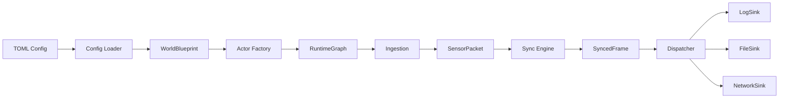

# 架构设计

## 数据流



## 线程/任务模型

| 组件 | 模型 | 说明 |
|------|------|------|
| Ingestion | 回调线程 + tokio::mpsc | 回调线程不阻塞 |
| Sync Engine | tokio task | 事件驱动 |
| Dispatcher | 每 sink 一个 task | 隔离慢 sink |

## 背压策略

| 通道 | 策略 | 默认 |
|------|------|------|
| Ingestion → Sync | drop_oldest | 容量 100 |
| Sync → Dispatcher | bounded | 容量 50 |
| Dispatcher → Sink | per-sink queue | 容量可配置 |

## 错误分层

```
ContractError
├── ConfigParse / ConfigValidation
├── CarlaConnection / CarlaSpawn
├── Ffi / PayloadParse
├── SyncTimeout / BufferOverflow
└── SinkWrite / SinkConnection
```

## 指标命名

| 指标 | Labels | 说明 |
|------|--------|------|
| `ingest_rate` | sensor_id, sensor_type | 摄取速率 |
| `buffer_depth` | sensor_type | 缓冲深度 |
| `sync_latency` | - | 同步延迟 |
| `dropped_packets` | sensor_id | 丢包计数 |
| `sink_queue_len` | sink_name | Sink 队列长度 |
