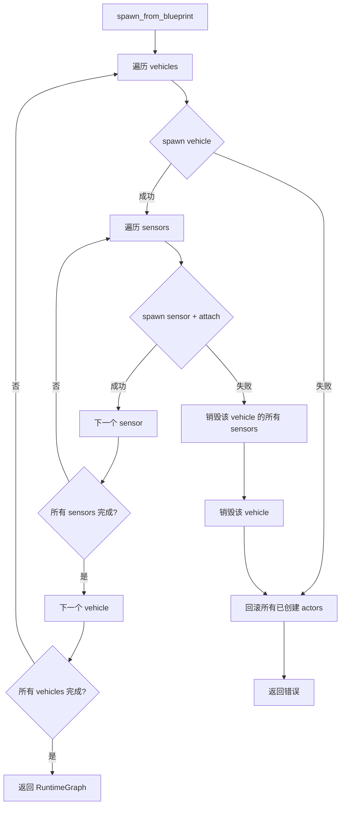

# Actor Factory 设计文档

## 概述

Actor Factory 负责将 `WorldBlueprint` 转换为 `RuntimeGraph`，管理 CARLA actors 的完整生命周期。

## Spawn 流程



## 回滚策略

### 原则
1. **原子性**：spawn 全成功或全失败
2. **顺序销毁**：先 sensors 后 vehicles（逆序）
3. **Best-effort**：销毁失败记录日志但不中断

### 失败场景

| 场景 | 回滚动作 |
|------|----------|
| vehicle spawn 失败 | 销毁该 vehicle 前所有已创建 actors |
| sensor spawn 失败 | 销毁该 vehicle 及其 sensors，再销毁之前 vehicles |
| sensor attach 失败 | 同上 |

## Teardown 语义

```rust
pub async fn teardown(&self, graph: &RuntimeGraph) -> Result<()>
```

### 幂等保证
- 对不存在的 actor 调用 destroy：记录日志，不报错
- 多次调用 teardown：安全

### 销毁顺序
1. 所有 sensors
2. 所有 vehicles

## 并发时序

1. **Vehicle 优先**：先 spawn 所有 vehicles
2. **Sensor 顺序 attach**：每个 vehicle 的 sensors 顺序 spawn
3. **Ingestion 回调**：所有 spawn 完成后才允许注册

## 日志规范

| 事件 | 级别 | 内容 |
|------|------|------|
| spawn_vehicle | INFO | vehicle_id, blueprint, actor_id |
| spawn_sensor | INFO | sensor_id, parent_vehicle, actor_id |
| destroy_actor | INFO | actor_id, config_id |
| rollback | WARN | reason, actors_to_destroy |
| destroy_failed | ERROR | actor_id, error |
