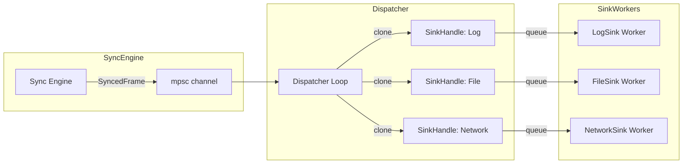

# Dispatcher + Sinks Design

## Architecture Overview



## 1. Concurrency Model

### 1.1 Fan-out Pattern
- Dispatcher consumes `SyncedFrame` from input channel
- Clones frame to each registered `SinkHandle`
- Each sink operates independently via dedicated tokio task

### 1.2 SinkHandle Design
```rust
pub struct SinkHandle {
    name: String,
    tx: mpsc::Sender<SyncedFrame>,  // Queue to worker
    metrics: Arc<SinkMetrics>,
}
```

### 1.3 Queue Strategy Options (Configurable)
| Strategy | Description | Default |
|----------|-------------|---------|
| Drop | Drop newest when full | ✓ |
| Block | Block dispatcher (not recommended) | |
| DropOldest | Drop oldest in queue | |

**Default**: `try_send()` with Drop on full - never blocks main path

## 2. Failure Strategy

### 2.1 Per-Sink Isolation
- Each sink worker catches all errors
- Errors logged + metrics incremented
- Other sinks unaffected

### 2.2 Error Handling Flow
```rust
async fn sink_worker<S: DataSink>(mut sink: S, mut rx: mpsc::Receiver<SyncedFrame>) {
    while let Some(frame) = rx.recv().await {
        if let Err(e) = sink.write(&frame).await {
            // Log error, increment failure counter
            // Continue processing next frame
        }
    }
}
```

### 2.3 Optional: Circuit Breaker (Future)
- After N consecutive failures, pause sink for backoff period
- Prevents log spam and resource waste

## 3. Metrics

| Metric | Type | Description |
|--------|------|-------------|
| `sink_queue_len` | Gauge | Current queue depth per sink |
| `sink_write_rate` | Counter | Successful writes per sink |
| `sink_failures` | Counter | Write failures per sink |
| `dropped_by_sink` | Counter | Frames dropped due to full queue |

## 4. Sink Implementations

### 4.1 LogSink
- Logs frame summary to tracing
- Minimal overhead
- Format: JSON or structured text

### 4.2 FileSink
- Writes to disk with rolling strategy
- Configurable via `params`:
  - `base_path`: Output directory
  - `roll_by`: "frame_count" | "time"
  - `roll_size`: Frames per file or seconds per file

### 4.3 NetworkSink (UDP)
- Fire-and-forget UDP packets
- Configurable via `params`:
  - `addr`: Target address (e.g., "127.0.0.1:9999")
  - `format`: "bincode" | "json"

## 5. Configuration Example

```yaml
sinks:
  - name: debug_log
    sink_type: log
    queue_capacity: 50
    
  - name: file_recorder
    sink_type: file
    queue_capacity: 200
    params:
      base_path: /data/recordings
      roll_by: frame_count
      roll_size: "1000"
      
  - name: live_stream
    sink_type: network
    queue_capacity: 100
    params:
      addr: "192.168.1.100:9999"
      format: bincode
```

## 6. API

```rust
// Create dispatcher from config
pub async fn create_dispatcher(
    configs: Vec<SinkConfig>,
    input_rx: mpsc::Receiver<SyncedFrame>,
) -> Dispatcher;

// Dispatcher methods
impl Dispatcher {
    pub fn run(self) -> JoinHandle<()>;
    pub fn metrics(&self) -> Vec<(String, SinkMetrics)>;
}
```
