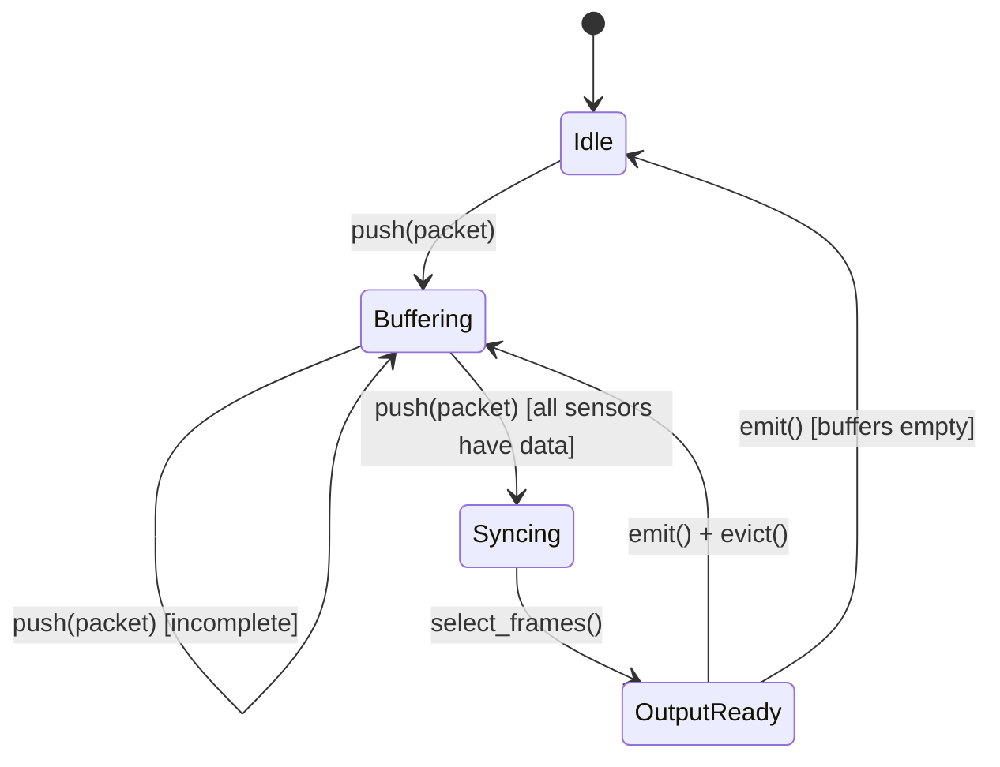

# Sync Engine Design Document

> Detailed design for multi-sensor synchronization with AdaKF time offset estimation

## 1. State Machine



### State Descriptions

| State | Description |
|-------|-------------|
| **Idle** | No packets in any buffer |
| **Buffering** | Collecting packets, waiting for all required sensors |
| **Syncing** | All sensors have ≥1 frame, performing frame selection |
| **OutputReady** | SyncedFrame ready for emission |

## 2. Queue Strategy (Per-Sensor Buffer)

### Data Structure

```rust
use std::collections::BinaryHeap;
use std::cmp::Ordering;

/// Wrapper for min-heap ordering by timestamp
#[derive(Debug, Clone)]
struct TimestampedPacket {
    packet: SensorPacket,
    sequence: u64,  // tie-breaker for same timestamp
}

impl Ord for TimestampedPacket {
    fn cmp(&self, other: &Self) -> Ordering {
        // Reverse for min-heap (earliest first)
        match other.packet.timestamp.partial_cmp(&self.packet.timestamp) {
            Some(Ordering::Equal) | None => {
                other.sequence.cmp(&self.sequence)
            }
            Some(ord) => ord,
        }
    }
}

/// Per-sensor buffer with timeout eviction
struct SensorBuffer {
    heap: BinaryHeap<TimestampedPacket>,
    max_size: usize,
    timeout_s: f64,
    sequence_counter: u64,
    
    // Metrics
    dropped_count: u64,
    out_of_order_count: u64,
}
```

### Operations

| Operation | Complexity | Description |
|-----------|------------|-------------|
| `push(packet)` | O(log n) | Insert with heap ordering |
| `peek()` | O(1) | View earliest packet |
| `pop()` | O(log n) | Remove earliest packet |
| `evict_expired(now)` | O(k log n) | Remove k expired packets |

## 3. IMU Adaptive Window Strategy

### Motion Intensity Calculation

```rust
/// Calculate motion intensity from latest IMU data
fn compute_motion_intensity(imu: &ImuData) -> f64 {
    let linear_mag = (imu.accelerometer.x.powi(2) 
                    + imu.accelerometer.y.powi(2) 
                    + imu.accelerometer.z.powi(2)).sqrt();
    let angular_mag = (imu.gyroscope.x.powi(2)
                     + imu.gyroscope.y.powi(2)
                     + imu.gyroscope.z.powi(2)).sqrt();
    
    // Normalize: gravity ~9.8 m/s², typical driving angular ~0.5 rad/s
    let linear_normalized = (linear_mag - 9.8).abs() / 5.0;  // 0-1 range
    let angular_normalized = angular_mag / 1.0;              // 0-1 range
    
    (linear_normalized + angular_normalized).clamp(0.0, 1.0)
}
```

### Window Mapping

```rust
/// Map motion intensity to window size
fn compute_window_size(intensity: f64, config: &WindowConfig) -> f64 {
    // Linear interpolation: high motion → small window
    // intensity=0 → max_window, intensity=1 → min_window
    let range = config.max_window_ms - config.min_window_ms;
    let window_ms = config.max_window_ms - (intensity * range);
    window_ms / 1000.0  // Convert to seconds
}
```

### Window Size Examples

| Motion Intensity | Window Size (ms) |
|------------------|------------------|
| 0.0 (stationary) | 100 |
| 0.25 | 80 |
| 0.5 | 60 |
| 0.75 | 40 |
| 1.0 (high motion) | 20 |

## 4. AdaKF Time Offset Estimation

### Mathematical Formulation

Using `adskalman` library with 1D state:

**State Vector**: `x = [offset]` (time offset relative to reference clock)

**Transition Model**:
```
x_k = F * x_{k-1} + w_k
where F = [1], Q = process_noise
```

**Observation Model**:
```
z_k = H * x_k + v_k
where H = [1], R = measurement_noise
z_k = t_selected - t_reference
```

### Adaptive Noise Update

```rust
struct AdaKF {
    kf: KalmanFilterNoControl<f64, U1, U1>,
    state: StateAndCovariance<f64, U1>,
    
    // Adaptive parameters
    residual_window: VecDeque<f64>,
    window_size: usize,
    base_r: f64,  // Base measurement noise
    base_q: f64,  // Base process noise
}

impl AdaKF {
    fn update(&mut self, observation: f64) -> (f64, f64) {
        // Standard KF update
        let obs = OVector::<f64, U1>::new(observation);
        let (new_state, residual) = self.kf.step(&self.state, &obs).unwrap();
        self.state = new_state;
        
        // Track residual
        self.residual_window.push_back(residual);
        if self.residual_window.len() > self.window_size {
            self.residual_window.pop_front();
        }
        
        // Adaptive: adjust R based on residual variance
        if self.residual_window.len() >= self.window_size / 2 {
            let var = self.compute_residual_variance();
            self.update_measurement_noise(var);
        }
        
        (self.state.state()[0], residual)
    }
    
    fn compute_residual_variance(&self) -> f64 {
        let mean: f64 = self.residual_window.iter().sum::<f64>() 
                       / self.residual_window.len() as f64;
        self.residual_window.iter()
            .map(|r| (r - mean).powi(2))
            .sum::<f64>() / self.residual_window.len() as f64
    }
    
    fn update_measurement_noise(&mut self, residual_var: f64) {
        // Scale R proportionally to residual variance
        // Bounded to prevent divergence
        let r_new = (self.base_r * residual_var).clamp(
            self.base_r * 0.1,  // Min: 10% of base
            self.base_r * 10.0  // Max: 10x base
        );
        // Update observation model with new R
    }
}
```

### AdaKF Trigger Conditions

| Condition | Action |
|-----------|--------|
| Residual variance increasing | Increase R (less trust in measurements) |
| Residual variance decreasing | Decrease R (more trust in measurements) |
| Large jump in offset | Increase Q temporarily |
| Stable offset | Decrease Q |

## 5. Frame Selection Algorithm

```rust
fn select_frames(
    buffers: &mut HashMap<String, SensorBuffer>,
    reference_id: &str,
    window: f64,
    offsets: &HashMap<String, AdaKF>,
) -> Option<HashMap<String, SyncedPacket>> {
    // 1. Get reference time from main sensor
    let ref_buffer = buffers.get(reference_id)?;
    let ref_packet = ref_buffer.peek()?;
    let t_ref = ref_packet.packet.timestamp;
    
    // 2. For each sensor, find best frame within window
    let mut selected = HashMap::new();
    
    for (sensor_id, buffer) in buffers.iter() {
        let offset = offsets.get(sensor_id)
            .map(|kf| kf.state.state()[0])
            .unwrap_or(0.0);
        
        // Corrected target time
        let t_target = t_ref + offset;
        
        // Find closest frame within window
        let best = buffer.find_closest_in_window(t_target, window);
        
        if let Some(packet) = best {
            selected.insert(sensor_id.clone(), SyncedPacket {
                packet: packet.clone(),
                corrected_timestamp: packet.timestamp - offset,
                interpolated: false,
                time_delta: packet.timestamp - t_target,
            });
        }
    }
    
    Some(selected)
}
```

## 6. Complexity Analysis

| Component | Time | Space |
|-----------|------|-------|
| Push to buffer | O(log n) | O(1) |
| Frame selection | O(m × k) | O(m) |
| AdaKF update | O(1) | O(w) |
| Full sync cycle | O(m × (log n + k)) | O(m × n) |

Where:
- n = buffer size per sensor
- m = number of sensors
- k = frames in window
- w = residual window size

## 7. Configuration Schema

```rust
#[derive(Debug, Clone, Deserialize)]
pub struct SyncEngineConfig {
    /// Reference sensor ID
    pub reference_sensor_id: String,
    
    /// Required sensor IDs (must all have data to output)
    pub required_sensors: Vec<String>,
    
    /// IMU sensor ID (for adaptive window)
    pub imu_sensor_id: Option<String>,
    
    /// Window configuration
    #[serde(default)]
    pub window: WindowConfig,
    
    /// Buffer configuration
    #[serde(default)]
    pub buffer: BufferConfig,
    
    /// AdaKF configuration
    #[serde(default)]
    pub adakf: AdaKFConfig,
    
    /// Missing data strategy
    #[serde(default)]
    pub missing_strategy: MissingDataStrategy,
}

#[derive(Debug, Clone, Deserialize)]
pub struct WindowConfig {
    pub min_ms: f64,  // default: 20.0
    pub max_ms: f64,  // default: 100.0
}

#[derive(Debug, Clone, Deserialize)]
pub struct BufferConfig {
    pub max_size: usize,      // default: 1000
    pub timeout_s: f64,       // default: 1.0
}

#[derive(Debug, Clone, Deserialize)]
pub struct AdaKFConfig {
    pub initial_offset: f64,   // default: 0.0
    pub process_noise: f64,    // default: 0.0001
    pub measurement_noise: f64, // default: 0.001
    pub residual_window: usize, // default: 20
}

#[derive(Debug, Clone, Copy, Default, Deserialize)]
#[serde(rename_all = "snake_case")]
pub enum MissingDataStrategy {
    #[default]
    Drop,
    Empty,
    Interpolate,
}
```
